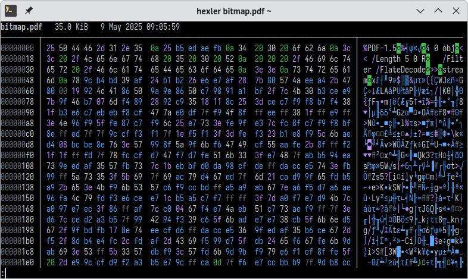

# hexler

[](https://github.com/martinus/hexler/actions/workflows/ci.yml)
[](https://github.com/martinus/hexler/actions/workflows/release.yml)
[](https://opensource.org/licenses/MIT)

A colorful hex viewer with sensible defaults and terminal-friendly output.



## Features

- **Terminal-aware**: Automatically adjusts to full terminal width
- **Colorized output**: Easy-to-read syntax highlighting for different byte types  
- **Pager integration**: Uses your system pager by default (like `git` and `man`)
- **Enhanced readability**: Displays CP437 characters for better visual parsing

## Why hexler?

While excellent tools like [hexyl](https://github.com/sharkdp/hexyl) and [hastyhex](https://github.com/skeeto/hastyhex) exist, hexler focuses on practical everyday use with reasonable defaults. Originally created as a Rust learning project, it's evolved into my go-to hex viewer for its clean output and terminal integration.

## Installation

### From Releases (Recommended)

Download the latest binary for your platform from the [Releases page](https://github.com/martinus/hexler/releases).

#### Linux
```bash
# Download and install (example for x86_64)
wget https://github.com/martinus/hexler/releases/latest/download/hexler-linux-x86_64
chmod +x hexler-linux-x86_64
sudo mv hexler-linux-x86_64 /usr/local/bin/hexler
```

#### macOS
```bash
# Download and install (example for Apple Silicon)
wget https://github.com/martinus/hexler/releases/latest/download/hexler-macos-aarch64
chmod +x hexler-macos-aarch64
sudo mv hexler-macos-aarch64 /usr/local/bin/hexler
```

#### Windows
Download `hexler-windows-x86_64.exe` from the releases page and add it to your PATH.

### From Source

```bash
# Build from source
git clone https://github.com/martinus/hexler.git
cd hexler
cargo build --release
```

The binary will be available at `target/release/hexler`.

### From crates.io

```bash
cargo install hexler
```

## Usage

```bash
# View a file with pager
hexler file.bin

# Output directly to stdout  
hexler --stdout file.bin

# Pipe to hexler
cat file.bin | hexler
```

## Performance Benchmark

Output size and runtime when processing a 181 MB executable (tested with `time hexler --stdout filename >/dev/null`):

| Output (MB) | Runtime (s) | Tool     | Sample Output |
|------------:|------------:|----------|---------------|
|        2004 |       2.210 | hexler   | `00004e80:  74 72 45 76 00 5f 5a 4e  53 74 38 69 6f 73 5f 62  trEv._ZNSt8ios_b` |
|        2729 |       1.002 | hastyhex | `00004e80  74 72 45 76 00 5f 5a 4e  53 74 38 69 6f 73 5f 62  trEv._ZNSt8ios_b` |
|        2745 |      24.213 | hexyl    | `│00004e80│ 74 72 45 76 00 5f 5a 4e ┊ 53 74 38 69 6f 73 5f 62 │trEv⋄_ZN┊St8ios_b│` |
|        4195 |       4.371 | hexxy    | `0004e80: 7472 4576 005f 5a4e 5374 3869 6f73 5f62  trEv._ZNSt8ios_b` |
|        4757 |       5.354 | xxd      | `00004e80: 7472 4576 005f 5a4e 5374 3869 6f73 5f62  trEv._ZNSt8ios_b` |
|        8598 |      24.213 | tscd     | `00004e80:  74 72 45 76 00 5f 5a 4e 53 74 38 69 6f 73 5f 62  trEv·_ZNSt8ios_b` |


## Comparison with Similar Tools

### Color Schemes

**TSCD** ([repo](https://github.com/fosres/TSCD))
- Red: non-printable • Orange: alphabetic • Yellow: digits • Green: whitespace • Purple: punctuation • Gray: NUL

**hastyhex** ([repo](https://github.com/skeeto/hastyhex))  
- Green: whitespace (0a, 0b, 0c, 0d, 20) • Blue: printable (21-7e) • Yellow: non-printable • Gray: NUL

**hexxy** ([repo](https://github.com/sweetbbak/hexxy))
- 256 different colors

**xxd** (system tool)
- Basic colorization

**xd** ([repo](https://bitbucket.org/delan/xd/src/default/))
- Gray & white theme • Prints ALL characters

**hexyl** ([repo](https://github.com/sharkdp/hexyl))
- Feature-rich with beautiful output
