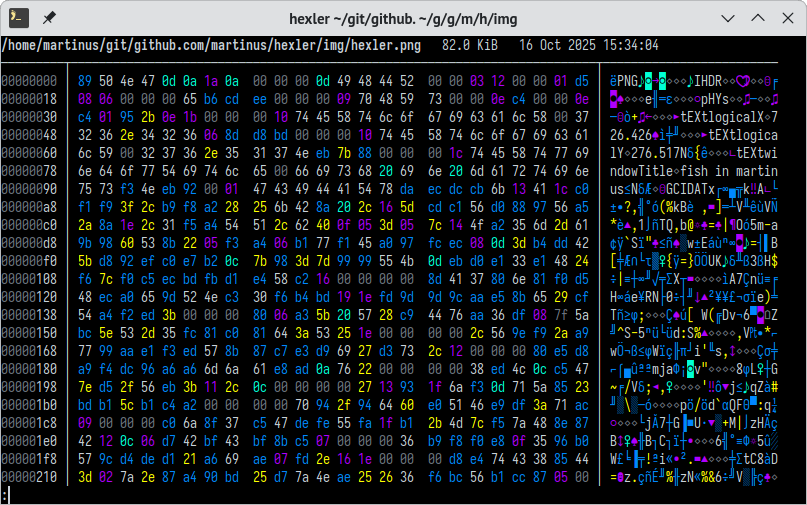
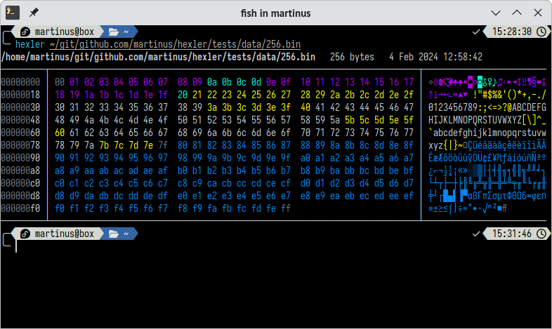
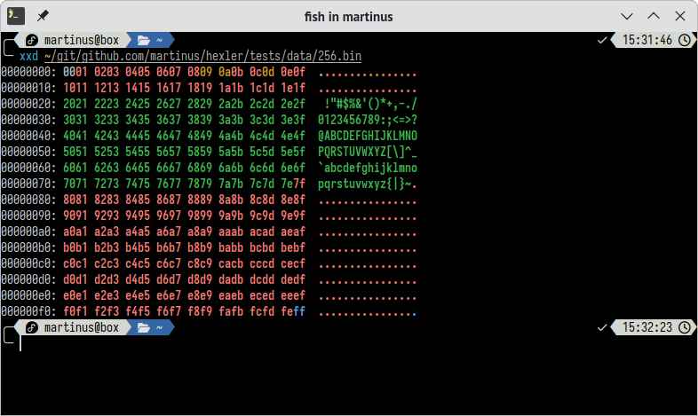
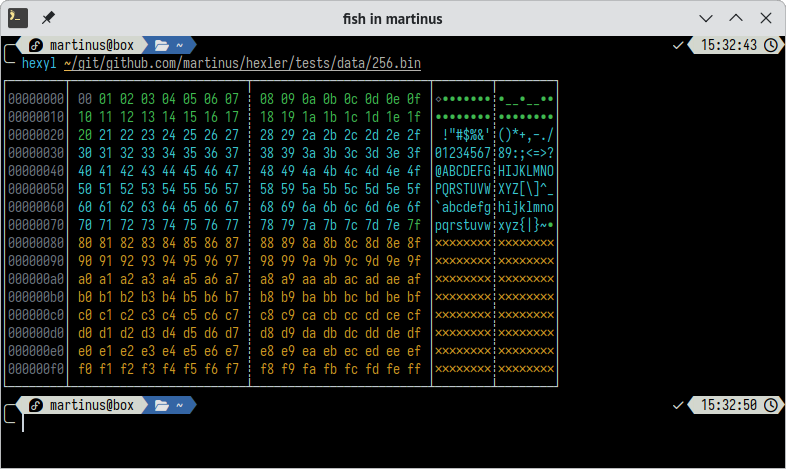
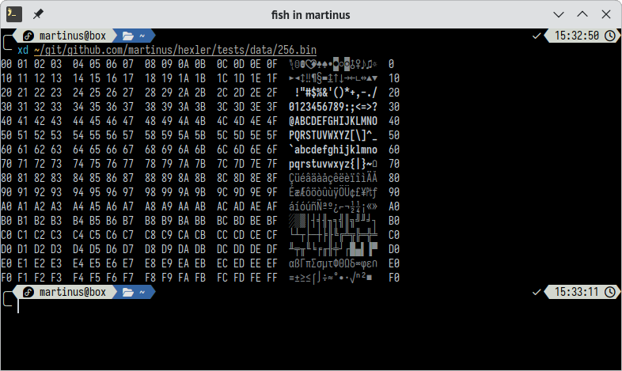

# hexler

[](https://github.com/martinus/hexler/actions/workflows/ci.yml)
[](https://github.com/martinus/hexler/actions/workflows/release.yml)
[](https://opensource.org/licenses/MIT)

A fast & colorful hex viewer with sensible defaults and terminal-friendly output.



## Features

- **Terminal-aware**: Automatically adjusts to full terminal width
- **Colorized output**: Easy-to-read syntax highlighting for different byte types  
- **Pager integration**: Uses your system pager by default (like `git` and `man`)
- **Enhanced readability**: Displays CP437 characters for better visual parsing
- **Fast**: Can dump about 250 MB/sec colored output to the terminal

## Why hexler?

While excellent tools like [hexyl](https://github.com/sharkdp/hexyl) and [hastyhex](https://github.com/skeeto/hastyhex) exist, hexler focuses
on practical everyday use with reasonable defaults. Originally created as a Rust learning project, it's evolved into my go-to hex viewer
for its clean output and terminal integration.

## Installation

### From Source

```bash
# Build from source
git clone https://github.com/martinus/hexler.git
cd hexler
make install
```

The binary will be available at `~/.cargo/bin/hexler`.

## Usage

```bash
# View a file with pager
hexler file.bin

# Output directly to stdout  
hexler --stdout file.bin

# Pipe to hexler
cat file.bin | hexler
```

## Performance Benchmark

Output size and runtime when processing a 181 MB executable, tested with `hyperfine --warmup 1 --show-output "hexler --stdout filename >/dev/null"`

| Runtime (s) | Tool       | Comment
|------------:|------------|------------
|       0.443 | `hastyhex` | Doesn't print extended ASCII characters, no pager
|       0.820 | `hexler`   | Colors, prints extended characters, shows borders, automatically uses `less` pager, automatically detects terminal width
|       2.337 | `xxd`      | Colors, but no extended charcters, no pager
|       3.986 | `hexyl`    | Colors, shows borders, but no pager and no extended characters
|       4.826 | `xd`       | Prints extended ASCII characters, only grey, no pager
|       --    | `hexxy`    | Crashes on random data


## Screenshot Comparison with Similar Tools

All the screenshots were taken in default configuration, when run on the `256.bin` file.

### hastyhex

Source: https://github.com/skeeto/hastyhex


### hexler

Source: https://github.com/martinus/hexler



### xxd

Installed with packaging of Fedora Linux.



### hexyl

Source: https://github.com/sharkdp/hexyl



### xd

Source: https://lib.rs/crates/xd


